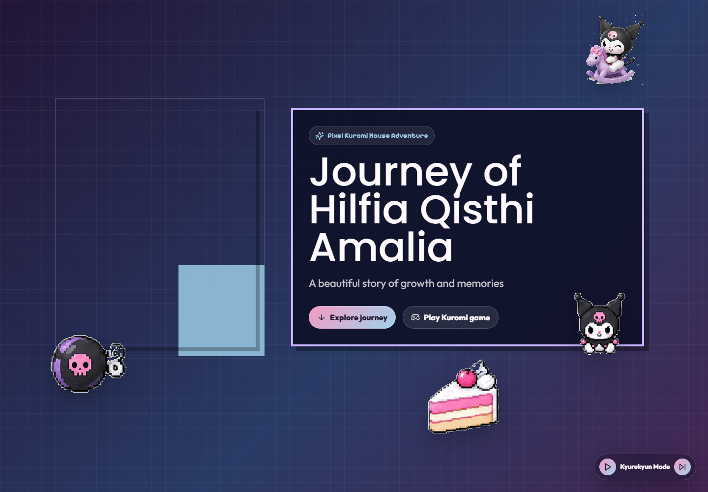
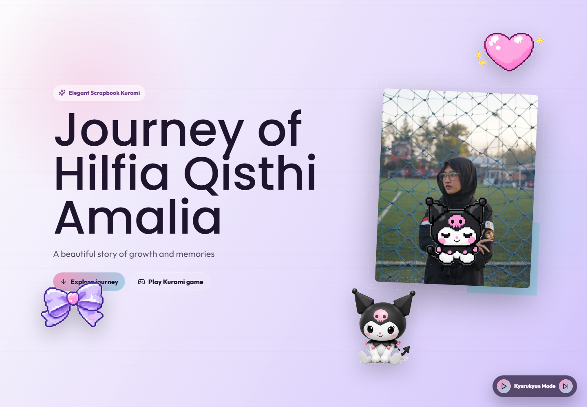

# JourneyHil

JourneyHil adalah website kenangan bertema Kuromi untuk Hilfia Qisthi Amalia. Web ini berisi profil, story, timeline, galeri, soundtrack kecil, dan mini game Kuromi Care yang stat-nya tersimpan otomatis.

## Preview

### Root / Magical


### Magical Theme


### Pixel Theme



### Scrapbook Theme



## Fitur

- Tiga tema web: Magical, Pixel, dan Scrapbook.
- Timeline perjalanan, profil, story, dan galeri foto/video.
- Music player dengan beberapa soundtrack.
- Mini game Kuromi Care dengan hunger, energy, cleanliness, dan happiness.
- Stat game autosave di browser.
- Share link stat game lewat snapshot URL, jadi stat bisa dibuka dan dilanjutkan di device lain.

## Route

- `/` - Magical theme utama.
- `/theme/magical` - versi Magical.
- `/theme/pixel` - versi Pixel.
- `/theme/scrapbook` - versi Scrapbook.

## Jalankan Lokal

```bash
npm install
npm run dev
```

Build production:

```bash
npm run build
```

Test:

```bash
npm test
```

## Tech Stack

- React
- TypeScript
- Vite
- Tailwind CSS
- Framer Motion
- Lucide React
- Vitest
