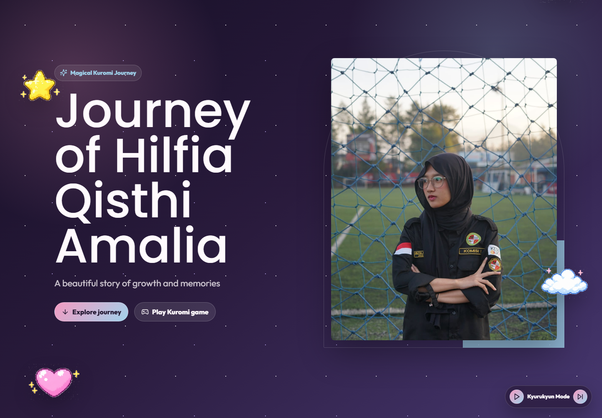

# JourneyHil Magical

JourneyHil Magical adalah website kenangan bertema Magical Kuromi untuk Hilfia Qisthi Amalia. Halaman ini menyatukan profil, cerita kedekatan, timeline perjalanan, galeri, soundtrack, dan mini game Kuromi Care dalam satu pengalaman utama.

## Preview

### Magical Theme



## Section Website

### Hero

Section pembuka yang langsung mengenalkan tema Magical Kuromi Journey. Di dalamnya ada judul Journey of Hilfia Qisthi Amalia, foto utama, tombol untuk menuju perjalanan, dan tombol untuk langsung bermain Kuromi Care.

### About Hilfia

Section profil yang menampilkan identitas Hilfia, kota, tanggal lahir, Instagram, hal favorit, game favorit, karakter favorit, dan hobi. Bagian ini menjadi pengenal personal sebelum pengunjung masuk ke cerita dan dokumentasi.

### Story

Section cerita singkat yang merangkum proses kedekatan dari awal bertemu, sering main, obrolan yang makin panjang, sampai dinamika yang menjadi bagian dari perjalanan. Setiap cerita ditampilkan sebagai urutan memori.

### Timeline

Section perjalanan hidup dan aktivitas Hilfia dalam beberapa fase. Timeline memuat fase kecil, Bandung, SMK, Universitas Kebangsaan, awal dekat, Teater Lima Wajah, kepanitiaan, asisten lab, HMTL, dan DPM.

### Gallery

Section galeri yang mengumpulkan foto, video, aktivitas, organisasi, sekolah, dan momen personal. Galeri menggunakan data aset yang sudah diproses agar dokumentasi dapat ditampilkan sebagai satu story wall.

### Music Player

Pemutar musik kecil yang selalu tersedia di halaman. Pengunjung bisa play, pause, dan lanjut ke soundtrack berikutnya. Saat lagu selesai, player otomatis berpindah ke track berikutnya.

### Kuromi Care

Mini game perawatan Kuromi yang berada di section game. Pemain bisa memberi makan, menidurkan, memandikan, mengajak main, membagikan stat, dan reset progres yang tersimpan di browser.

## Logika Game Kuromi Care

### Stat Awal

Game dimulai dengan stat berikut:

- Hunger: 82
- Energy: 78
- Cleanliness: 86
- Happiness: 88
- Experience: 0

Semua stat dibatasi dari 0 sampai 100, jadi setiap perubahan akan tetap berada dalam rentang tersebut.

### Mood Kuromi

Mood ditentukan dari kondisi stat:

- Cleanliness di bawah 25 membuat Kuromi menjadi dirty.
- Hunger di bawah 25 membuat Kuromi menjadi sad.
- Energy di bawah 25 membuat Kuromi menjadi sleepy.
- Happiness di bawah 25 membuat Kuromi menjadi angry.
- Jika semua stat aman, Kuromi menjadi happy.

Urutan pengecekan mood mengikuti prioritas di atas, sehingga cleanliness yang rendah akan diprioritaskan sebelum hunger, energy, dan happiness.

### Penurunan Stat Otomatis

Setiap 30 detik, stat Kuromi turun otomatis:

- Hunger berkurang 5.
- Energy berkurang 3.
- Cleanliness berkurang 4.
- Happiness berkurang 2.

Setelah stat turun, mood dihitung ulang dan aksi aktif dibersihkan.

### Makanan

Saat pemain memilih makanan, Kuromi masuk aksi eat dan stat berubah sesuai item:

- Strawberry: hunger +18, happiness +8.
- Ice Cream: hunger +12, happiness +22.
- Cake: hunger +26, happiness +14.
- Milk: hunger +16, energy +8.
- Pudding: hunger +14, happiness +16.
- Donut: hunger +20, happiness +12.
- Cookies: hunger +14, happiness +10.
- Drink: hunger +8, energy +10.

### Station Action

Game memiliki tiga station utama:

- Bed menjalankan aksi sleep, energy +35 dan happiness +4.
- Bath menjalankan aksi bath, cleanliness +95 dan happiness +8.
- Toy menjalankan aksi play, happiness +30 dan energy -4.

Saat station dipilih, Kuromi berjalan ke posisi station, melakukan aksi, lalu kembali ke idle setelah animasi selesai.

### Sprite dan Animasi

Sprite Kuromi berubah mengikuti aksi dan mood:

- Eat memakai sprite makan.
- Bath memakai sprite mandi.
- Play memakai sprite main.
- Sleep memakai sprite sleepy.
- Jika tidak ada aksi aktif, sprite mengikuti mood dirty, sad, sleepy, angry, atau happy.

Saat Kuromi berjalan ke station, sprite berganti ke animasi lari kanan atau kiri berdasarkan posisi station.

### Penyimpanan dan Share

Stat game otomatis disimpan ke `localStorage` dengan key `journeyhil:kuromi-care-stats:v1`. Jika halaman dibuka dengan query `gameStats`, data tersebut dibaca sebagai snapshot share, disimpan ke browser, lalu query dihapus dari URL.

Tombol Share membuat URL berisi snapshot stat dalam format base64-url. Tombol Reset menghapus stat tersimpan dan mengembalikan game ke stat awal.

## Route

- `/` - Magical theme utama.
- `/theme/magical` - Magical theme eksplisit.

## Jalankan Lokal

```bash
npm install
npm run dev
```

Build production:

```bash
npm run build
```

Test:

```bash
npm test
```

## Tech Stack

- React
- TypeScript
- Vite
- Tailwind CSS
- Framer Motion
- Lucide React
- Vitest
